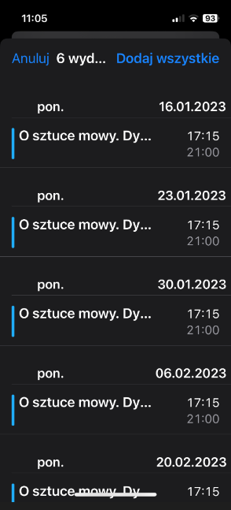

# Generator kalendarzy zajęć Uniwersytetu Otwartego UW

Skrypt powstał na fali frustracji po zapisaniu się na zajęcia Uniwersytetu Otwartego UW, który podaje plan wyłącznie w formie tabelek na stronie, bez możliwości subskrybowania kalendarzy. 

Ten skrypt generuje pliki `*.ics`, które powinny dać się zaimportować do każdego współczesnego kalendarza.

## Jak zainstalować

W konsoli instalujemy zależności programu:

```
pip install -r requirements.txt
```

## Jak używać

Uruchamiamy skrypt:

```
python generator.py [url]|[url,nazwa_grupy] ([url2]|[url2,nazwa_grupy], ...) 
```

Na przykład:

```
python generator.py https://www.uo.uw.edu.pl/kurs/12345,K/0000/99 
```

Nazwa grupy jest opcjonalna, w takim wypadku program sam pobierze pierwszą dostępną grupę z kursu.

Można podać więcej kursów w jednym poleceniu, np.:

```
python generator.py https://www.uo.uw.edu.pl/kurs/12345,K/0000/99 https://www.uo.uw.edu.pl/kurs/99999,K/0000/22 
```

Wynikowe pliki `*.ics` pojawią się w katalogu skryptu. Po ich otwarciu na urządzeniu mobilnym powinna pojawić się opcja dodania serii wydarzeń:


